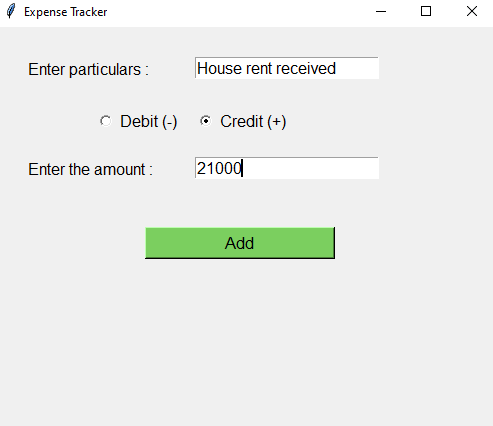
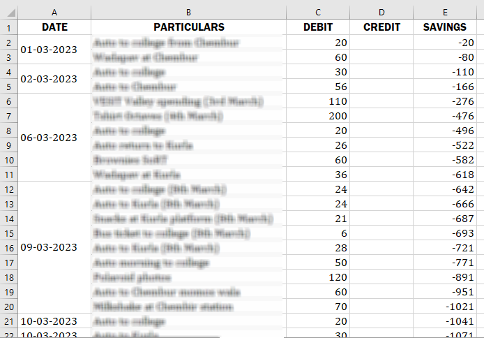

# ExpenseTracker

Manage and track your expenses and income in a much better way! The data you enter will be stored in an Excel spreadsheet and the entries of the same date will be merged to give a much cleaner look.

IMPORTANT:- Change the value in the "loc_folder" variable and set it to equal to your folder path where you want the excel file to be stored
Track your daily expense. Used openpyxl in Python, takes date from the datetime module

---

## Preview

### GUI

### Excel sheet data

